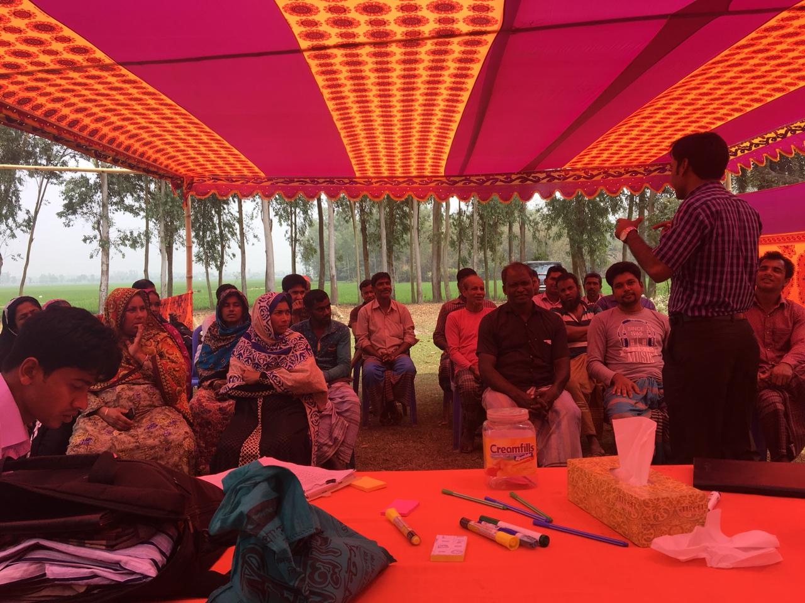
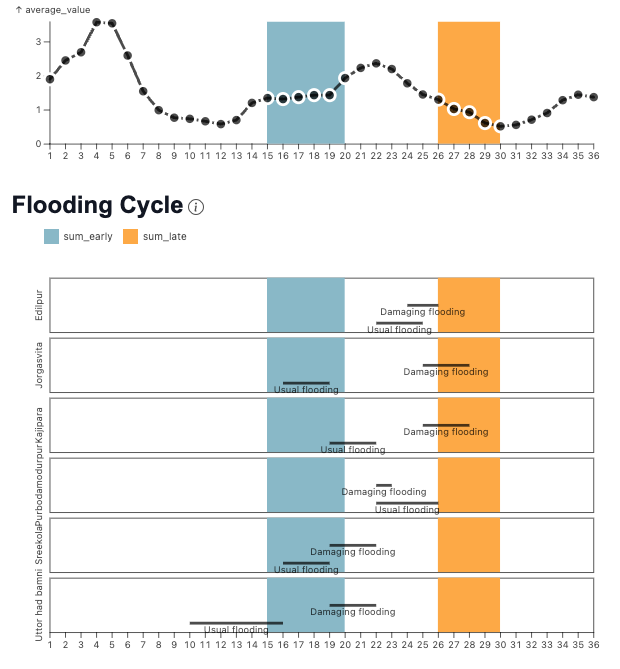

# Bangladesh Example

We can also learn from a related example in Bangladesh, with village meetings led by BRAC field experts.

When looking at flooding, initial work prior to talking with farmers led to a prototype index based on the peak flooding time of the agricultural season approximately in decads 15-20.  

In quantitative focus groups, farmers mentioned the years that they were most hurt by flooding.  Then the mentioned the times of the season were when flooding usually happened, which was when farmers expected it, and planned around it.
The farmers said that they experienced particularly damaging flooding if unusual flooding occured later in the season.

Below you can see average rainfall and the times that the farmers talked about for different areas in the Sadullapur region.
Ive roughly highlighted example windows for the usual flooding in blue, and damaging later flooding in orange.

Below is the set of ranked years that farmers said the were hurt by flooding, along with the years that had high rainfall in the higher flooding time of the season.  I set the frequency of the payouts to 30% which is more often than insurance typically pays out in order to get a sense of if the model was capturing the loss years, even if not strongly enough for insurance financing.

You can see that the early part of the season only hits one of the problem years.  This could mean that the timing is wrong, the satellite is wrong, or the farmer recollections are wrong. In any case, its not the best sign. And below, as you might have guessed I would put, is the figure with the late flood bad years.

In that figure, you can see that the later "damaging flooding" sums of rainfall have noticable deficits in 4 out of the 5 farmer recollected years. There are also lots of "false alarms, of small deficits in other years, which is usually bad for an index, but at this stage of the design, with simple sums, this gives us vaulable insights.  A helpful sign is that the biggest years have pretty much the worst deficits. In the actual project, the partners changed the metric from total rainfall to percent of area innundated, which addressed the many small false payouts issue.

Have fun playing with the sliders in the tool below.  Keep in mind that the farmer seasonal information is only available for a subset of the regions from this exercise, and that the rainfall totals used in the tool at this stage are not the percent of land innundated that was used for the recommended index.  Note the sensitivities to the timings, and also note that answers are different for different regions.  

Thats why its important to check!

    <iframe id="resizableFrame"
        src="https://columbia-desdr.github.io/Sliders-bangladesh/config"
        width="1200" height="1300"
        style="border:1px solid black; transition: all 0.3s ease;"></iframe>

