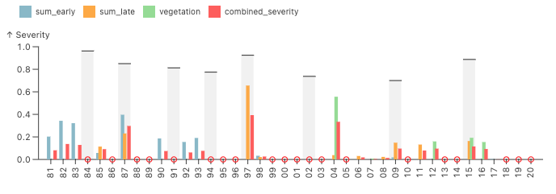

# Evaluating information and indexes

The chart below compares the bad years that the village reported with the years that had low rainfall in the satellite record, during the highlighted times just discussed.

* **Years** are listed on the **x axis**
* **Taller** bars are **worse** years, 
* **Grey** bars are the **farmer reported droughts**
* The **Tallest** grey bar is the **worst year** the village remembered

The satellite rainfall record is filtered by the farmer reported vulnerability timing

* The early season sowing (blue), late season flowering (orange), and vegetative de-greening (green) periods are the same colors as before

* the colored bars represent how bad the satellite rainfall was during those decads in each year

* There is an additional red bar that represents if any of the satellite metrics (the combined severity) reflected a bad year, which was used to design the insurance index.

* A red o marks any year where none of the satellite indicators were bad enough to be considered a meaningful deficit.

You can explore the agreement in the information 

* Which years did the farmers say were bad that were also represented in the satelite data for the reported seasonal timing?

* Which farmer bad years were not reflected in the satellite data with that timing?

* What is the ratio of years with hits vs misses?

The answers to those questions are summarized automatically if you scroll to the matching table at the bottom of the page.

In the matching table, you can see how much any data source matched another by looking at the rows and colums.  For example, you can see that the combined severity agreed with the farmer bad years 50% of the time.

*But what if we wanted to know the matching of the timing for rainfall vulnerability earlier in the season?*

