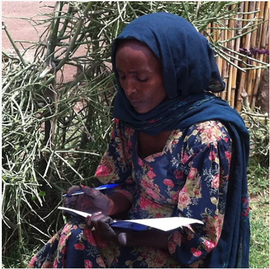
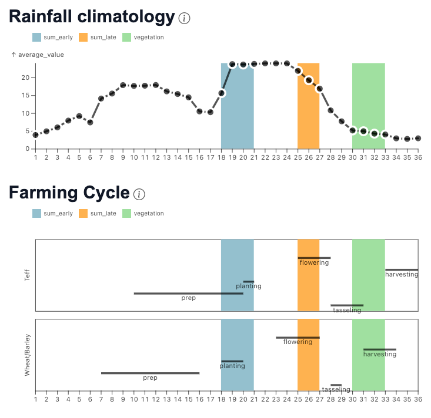

# Reported Rainfall timing in Village of Genete (Ethiopia)

In the village of Genete, we can perform this crosscheck.

We will use the timing of the season in decads, a common form for agronomists.  A decad reflects approximately 10 days from the new year, so decad 4 starts Feb 1, Decad 7 starts March 1, Decad 19 July 1, Decad 25 is September 1.

The quantitative focus group in Genete said that the key times they were vulnerable to rainfall were during flowering (late July and September) and preparation and planting, beginning in March and continuing into early July.

Below you can see the Rainfall climatology for the village, is the average rainfall during the year over their reported cropping cycle. The most vulnerable times of year initially reported are higlighted in blue for the beginning of the year, and orange for the flowering, later in the year.  

To provide ain dditional verification source, green bar reflects the timing that the vegetation 
would change color to reflect seasonal end, after the rainfall in the time highlighted in orange had passed, and the landscape had time to respond.

There was intense discussion about if the most important start of the season was decad 7 or 18.

