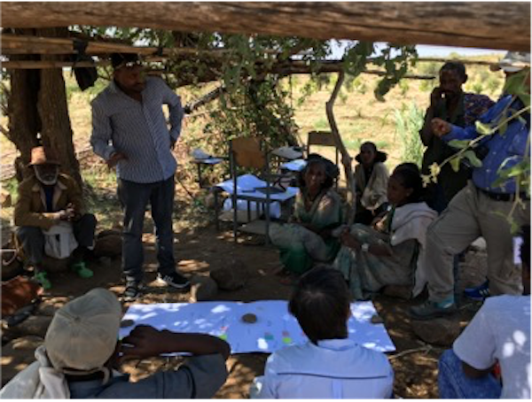

# Concrete input

In this example we utilize these two questions for concrete, specific input.

1. What specific times of year are you most vulnerable to drought?
2. What were the most severe drought years you have experienced?	

The drought years are ordered in severity by the community, with 1 being the worst year.

For strategies that have been low cost and scalable in effectively framing these questions to communities, 
you can refer to [Project Field Guides](https://fist.iri.columbia.edu/publications/docs/R4FieldGuide/html/R4FieldGuide/R4FieldGuide_Initial.html)

