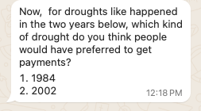

# Answers from Phone Feedback

The answers from the people who have completed the phone feedback "to date" (when I wrote this text) can help us think through what to do next in the index design.

##Remember that the phone feedback is from folks going through this exercise, so it is not from the actual people who would be benefitting from the product. 
This is only a training example to show how this information could be used!

But lets pretend the answers came from farmers, and community representatives...

The average answers were:
2002 50%
1984 50%

This illustrates that design is never easy!  Because were evenly split between wanting payouts in 2002 and 1984, it is still hard to make a choice, but could suggest that two different insurance products 
are what the community really wants.

But, we can dig deeper.  We can check the test question. If we assume that people who answered a test question "correctly" are giving more accurate answers, we can filter by that.  For our test question of which year was worse, 2009 or 2010 we believe 2009 is the correct answer.  

The respondents answered:
- 2009 62.5%
- 2010 37.5%

This means most people agreed with our belief.  We can use this to select people who we believe are answering more accurately.  We therefore do another attempt, where we calculate the responses of only the people who answered the test question "correctly".

Looking only at the people who answered the test question "correctly," we now have new results:
- 2002 80%
- 1984 20%

We could therefore select the design that focuses on the decads 10-17, based on the pretend farmer feedback from the participants of this illustration.  
Ironically, this is nearly the exact opposite of what the farmers themselves said when asked the same question.  In the actual project, the 60% of the actual farmers wanted the index that was from decads 6-17 
and 40% wanted the later window, because they wanted to de-risk loans for long cycle crops.  

One way to obtain fast feedback is to utilize two way phone text or recorded voice communications.
We have found that providing incentives for accuracy, such as awards, or games can be important.

However, these kinds of communications can yield noisy data, often with inaccurate or strategic responses. 

Research has found that two strategies can be effective in filtering information

1. Incentivize accuracy: provide a prize or honor for being more accurate
2. Verification questions: ask questions we know the answer to, and focus on responses of people who got those questions "right" 

Using the flexible NOKI platform in the DESDR toolkit we could set up this contest to quickly incentivize cogeneration feedback.

We can frame the question as a contest--how well could a farmer playing from a phone represent the preferences of their community over which kind of year is more important, 1984, or 2002. 

The player could win (and perhaps get a prize) if they can guess what others would say.

We also know that 2009 was consistently bad, and 2010 was consistently good, so we could also ask people to compare those years so to help filter results.

To experience an example of a phone codesign implimentation that you might use, text or whatsapp **Genete to +1 (646) 217-0881**

These tools are flexible for different cogeneration challenges, and they are open source. What would you use these tools and approaches for?

