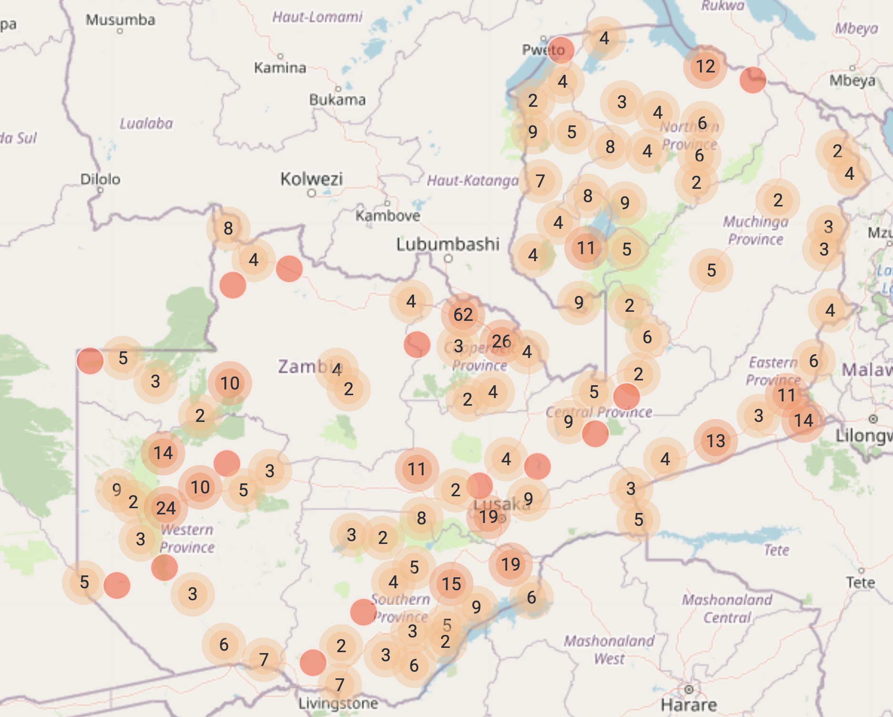

# Unlocking large scale feedback

Information from large scale co-design can include a lot of noise.  
It is necessary to have a strategy that can filter the truth from the noise.

## Key components

We need two components for this approach to quantitative client codesign

1. **Concrete specific input.** Open discussion is important in codesign, 
but for this part, it is critical to obtain engineering quality quantitative input. In the past
key design choices have been incorrect because the co-design was not adequately quantitative.
2. **Crosschecking verification.** It is important to have an evaluation mechanism embedded at the heart of the process to identify solutions and filter out noise.

## Real world performance

This strategy has been successful at large scales for low cost, in thousands of villages across dozens of countries. For example, in a project we worked on for WFP the government of Zambia performed this exercise across the entire country, with most of the site visits completed within a few weeks.

**We will work through an example for a satellite model of drought in Ethiopia, used for the WFP R4 insurance index.**

