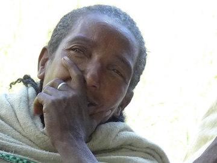

# Not enough information

Although years like 2009 is consistently bad, and 2010 is consistently good...

Using the design and evaluation tools we can see that there are multiple options with the same level of high agreement. For example.

The very early time period from decads 6-17:

* 88% agreement
* Reflects the challenges in 1984 
* Doesnt reflect 2002, and has very small anomalies (potentially small insurance payouts) in years like 1994

The slightly later time period from decads 10-17:

* 88% agreement
* Reflects 2002 and 1994 
* Doesnt reflect 1984

This is because the seasonal timing of rainfall in 2002 was later than that of 1984.  

# What would you do?

Explore the early window timing and say what looks best to you below.  If you need help, check the hint just below the form.

<iframe src="https://docs.google.com/forms/d/e/1FAIpQLSfa7XzpTGK-NXcNkxQxbpaLq6_TINaBQvKfp-c-Y1Fu1f9RrQ/viewform?embedded=true" width="1000" height="600" frameborder="0" marginheight="0" marginwidth="0">Loading…</iframe>

Hint: Dont feel like you have enough information to make these choices? Thats the point of this exercise!  Without client cogeneration inside of the design loop, we often do not have good ways to make these choices.  

If only we could ask the farmers if they would prefer to have coverage that focused on rainfall as early in the season as the deficit of 1984 or if they were able to shift their practices in response to the rainfall timing to want coverage that focused on the later timing of 2002.  Can you guess what we are leading up to?

Next we will explore a cogeneration tool that can address that challenge.

